# Virtualization Lab — Containerizing and Deploying a Java Web Application

Spring Boot REST service packaged as a Docker image, orchestrated locally with Docker Compose (web + MongoDB), published to Docker Hub, and deployed on an AWS EC2 instance running Amazon Linux 2023.

## Technology stack

| Component | Version |
|---|---|
| Java | 21 LTS (Amazon Corretto) |
| Maven | 3.9+ |
| Spring Boot | 4.1.1 |
| Docker Desktop | Docker Compose v2 |
| Database | MongoDB 8 |
| Deployment target | Amazon Linux 2023 (EC2) |

## Project structure

```
virtualization-lab/
├── virtualization-lab/          # Maven project (Spring Boot app)
│   ├── src/main/java/co/edu/escuelaing/webapplication/virtualization/lab/
│   │   ├── RestServiceApplication.java
│   │   └── HelloRestController.java
│   ├── pom.xml
│   ├── Dockerfile
│   └── compose.yaml
└── evidence/                    # Screenshots / exports used in this README
```

## Part 1 — Run the application locally

```bash
cd virtualization-lab
mvn clean package
java -jar target/virtualization-lab-1.0.0.jar
```

The application reads its port from the `PORT` environment variable (defaults to `8081` if not set):

```bash
PORT=6000 java -jar target/virtualization-lab-1.0.0.jar
```

Verify:

```
http://localhost:8081/greeting?name=Pedro
```

Expected response:

```
Hello, Pedro!
```

**Evidence:**

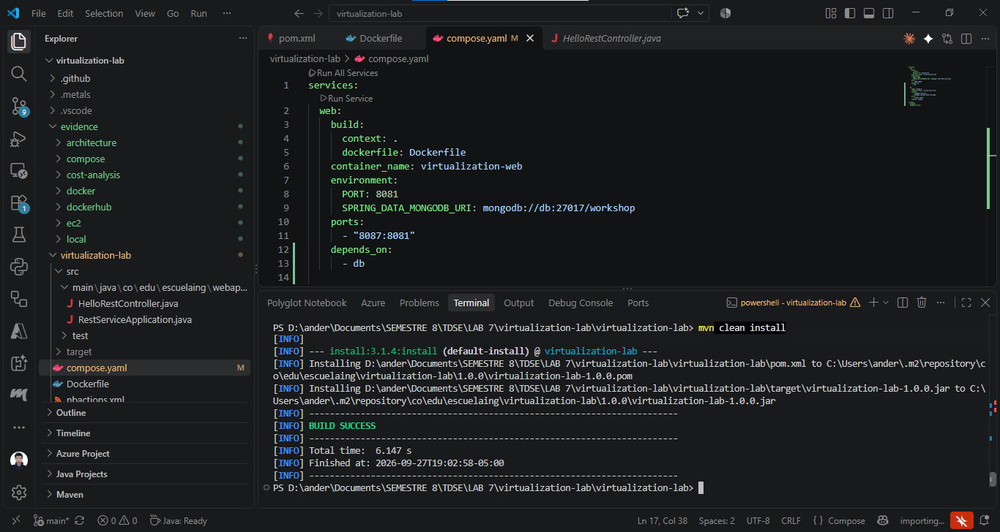
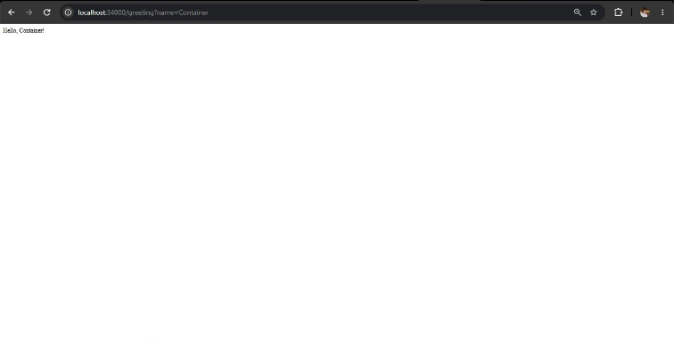

## Part 2 — Docker image and container isolation

Build the image:

```bash
cd virtualization-lab
docker build -t andyfg13/virtualization-lab:1.0 .
docker images
```

Run one container:

```bash
docker run -d \
  --name virtualization-lab-1 \
  -e PORT=8081 \
  -p 34000:8081 \
  andyfg13/virtualization-lab:1.0
```

Test: `http://localhost:34000/greeting?name=Container`

**Isolation test** — run two more independent instances of the same image:

```bash
docker run -d --name virtualization-lab-2 -p 34001:8081 andyfg13/virtualization-lab:1.0
docker run -d --name virtualization-lab-3 -p 34002:8081 andyfg13/virtualization-lab:1.0
```

Each container responds independently:

- `http://localhost:34001/greeting?name=Container2`
- `http://localhost:34002/greeting?name=Container3`

**Evidence:**

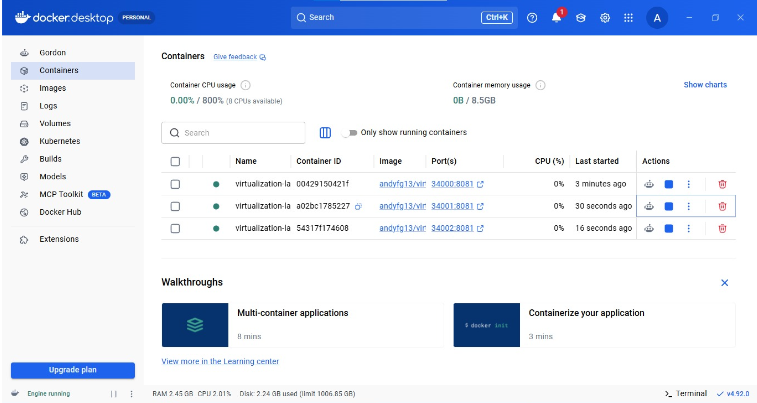

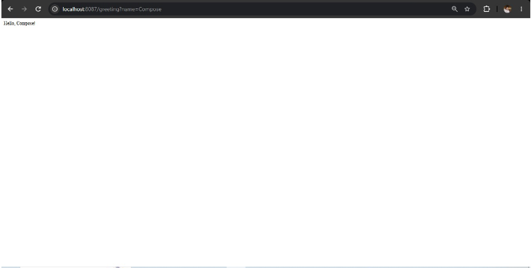
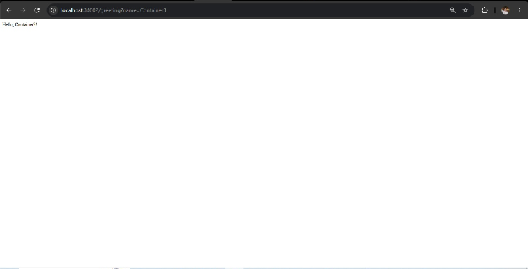
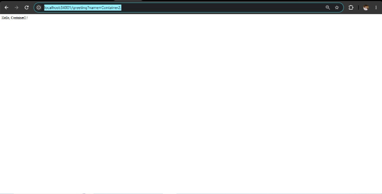

## Part 3 — Multi-container environment with Docker Compose

`compose.yaml` defines two services on the same Docker network: `web` (the Spring Boot app) and `db` (MongoDB 8), with named volumes so database data survives independently from the container lifecycle.

```bash
cd virtualization-lab
docker compose up -d --build
docker compose ps
docker compose logs web
docker compose logs db
```

Test: `http://localhost:8087/greeting?name=Compose`

Connect to MongoDB and verify:

```bash
docker compose exec db mongosh
```

```js
show dbs
use workshop
db.messages.insertOne({ message: "Hello from Docker Compose" })
db.messages.find()
exit
```

Tear down (keep data): `docker compose down`
Tear down and wipe data: `docker compose down -v`

**Evidence:**

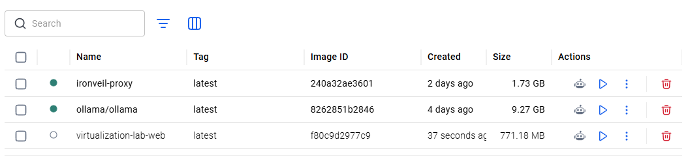
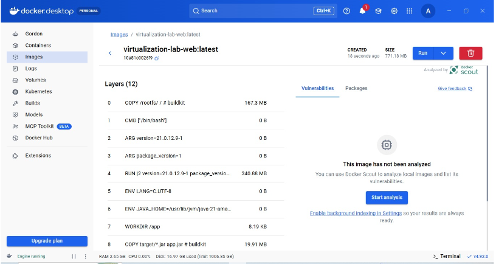
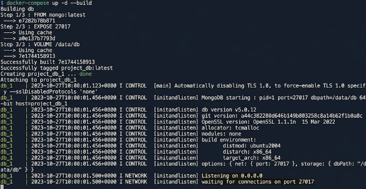

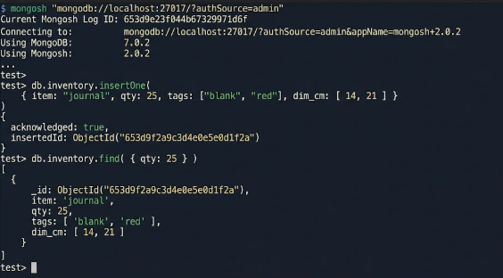

## Part 4 — Publish to Docker Hub

```bash
docker login
docker tag andyfg13/virtualization-lab:1.0 andyfg13/virtualization-lab:latest
docker push andyfg13/virtualization-lab:1.0
docker push andyfg13/virtualization-lab:latest
```

**Docker Hub repository:** [`https://hub.docker.com/repository/docker/andyfg13/virtualization-lab`](https://hub.docker.com/repository/docker/andyfg13/virtualization-lab)

**Evidence:**

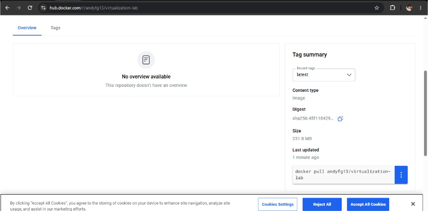

## Part 5 — Deploy on AWS EC2

- **Instance:** Amazon Linux 2023, `t2.micro` (or `t3.micro`)
- **Security group:** SSH (22) restricted to my public IP only; application port (8087) open only to the network that needs access.

```bash
sudo yum update -y
sudo yum install -y docker
sudo service docker start
sudo usermod -a -G docker ec2-user
# log out / reconnect

docker pull andyfg13/virtualization-lab:1.0
docker run -d \
  --name virtualization-lab \
  --restart unless-stopped \
  -e PORT=8081 \
  -p 8087:8081 \
  andyfg13/virtualization-lab:1.0

docker ps
docker logs virtualization-lab
```

**Public deployment URL:** [`http://44.223.101.92:8087/greeting?name=AWS`](http://44.223.101.92:8087/greeting?name=AWS)

**Evidence:**

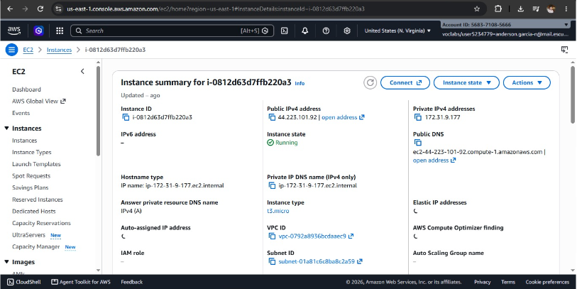
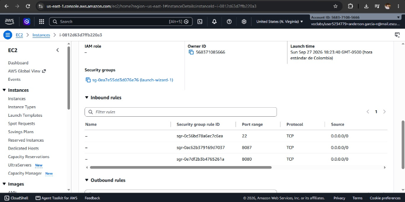
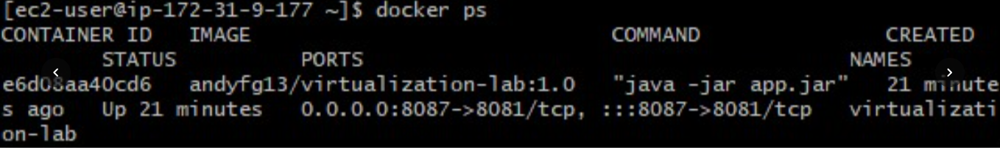
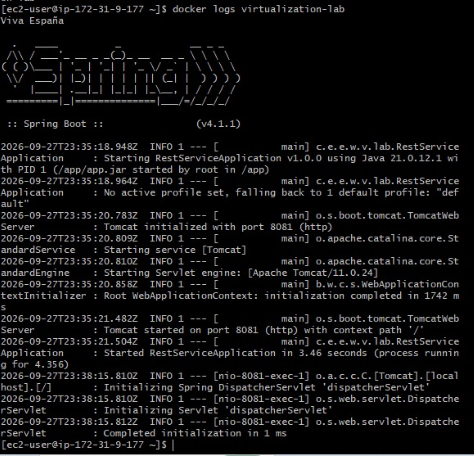
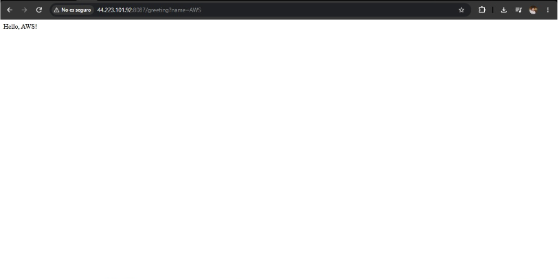

> Remember to terminate the EC2 instance once the workshop is graded to avoid ongoing charges.

## Part 6 — Deployment model and cost analysis

### Deployment model

```
Client
  ↓ HTTP request
EC2 virtual machine
  ↓
Docker Engine
  ↓
Java web application container
```

| Layer | Responsibility |
|---|---|
| EC2 virtual machine | Isolated compute, memory, storage, and network resources rented by the hour |
| Docker container | Portable execution environment containing the application and its runtime dependencies |
| Java web application | Receives HTTP requests and provides the business functionality |
| Security group | Controls which inbound traffic can reach the virtual machine |

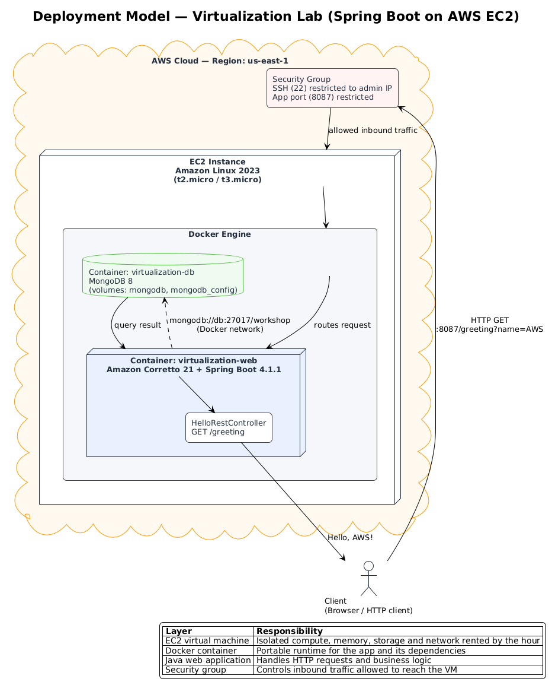

### Workload assumptions

| Scenario | Requests/month | Instance type | Instances | Runtime (hrs/month) | EBS storage | Outbound transfer | Avg req/resp size | Continuous? | HA required? |
|---|---|---|---|---|---|---|---|---|---|
| Small | 10,000 | t3.micro | 1 | 730 | 8 GB gp3 | ~1 GB | ~5 KB / ~2 KB | Yes (always on, low traffic) | No |
| Medium | 100,000 | t3.small | 1 | 730 | 8 GB gp3 | ~10 GB | ~5 KB / ~2 KB | Yes | No |
| Large | 1,000,000 | t3.medium ×2 (behind ALB) | 2 | 730 each | 16 GB gp3 each | ~100 GB | ~5 KB / ~2 KB | Yes | Recommended |

Region used for pricing: **us-east-1 (N. Virginia)**.

### Cost estimate

Generated with the [AWS Pricing Calculator](https://calculator.aws/).

**Evidence:**

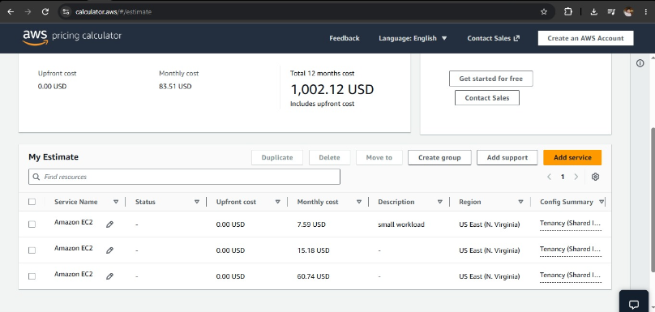

| Scenario | Monthly requests | Monthly infrastructure cost | Estimated cost per request | Main cost drivers |
|---|---|---|---|---|
| Small workload | 10,000 | USD 7.59 | USD 0.000759 | EC2 runtime (t3.micro, 730 h/month) |
| Medium workload | 100,000 | USD 15.18 | USD 0.0001518 | EC2 runtime (t3.small, 730 h/month) |
| Large workload | 1,000,000 | USD 60.74 | USD 0.00006074 | EC2 runtime (t3.medium × 2, 730 h/month each) |

> Values reflect the EC2 On-Demand compute cost shown in the Pricing Calculator export (`us-east-1`, Linux, 730 hours/month per instance). EBS storage and outbound data transfer for these workload sizes are marginal (a few cents/month) relative to compute and are considered part of the same estimate group.

Formula used:

```
Estimated cost per request = monthly infrastructure cost / monthly requests
```

### Architectural discussion

**Why does an EC2-based deployment have a baseline monthly cost even when the application receives few requests?**
Because EC2 bills for the instance being *reserved and running*, not per request — you pay for the allocated vCPU, memory, and attached EBS volume for every hour the instance is up, regardless of whether it serves 10 requests or 10,000.

**At which workload level does the fixed cost become less significant per request?**
Once request volume grows enough that compute is the bottleneck (roughly the medium-to-large boundary here), the fixed hourly cost gets amortized over far more requests, driving cost-per-request down sharply — the large-workload scenario has the lowest cost per request of the three.

**What would force a move from one EC2 instance to multiple instances?**
Sustained CPU/memory saturation, the need for zero-downtime deployments, fault tolerance against a single instance/AZ failure, or a requirement for horizontal scaling behind a load balancer to handle traffic spikes.

**Which additional services would a production deployment likely require?**
An Application Load Balancer for traffic distribution and TLS termination, a managed database (e.g., Amazon DocumentDB or RDS) instead of a self-hosted MongoDB container, CloudWatch for monitoring/alerting, automated EBS snapshot backups, and a container registry (Amazon ECR) to avoid depending on a public Docker Hub image in production.

**Would a serverless deployment be more cost-effective for the small-workload scenario?**
Yes — at 10,000 requests/month the workload is bursty and low-volume relative to a full-time EC2 instance's idle capacity. A Lambda + API Gateway deployment bills per invocation and per millisecond of execution, so idle time costs nothing, whereas the EC2 instance in this scenario is paid for 730 hours/month whether or not it is handling traffic. As request volume grows toward the large-workload scenario, the always-on EC2 cost gets amortized better and the serverless per-invocation cost starts to catch up or exceed it, so the crossover favors EC2 at higher, steadier volumes.

### Conclusion

For the small and medium workloads simulated here, a single EC2 instance is simple and predictable but under-utilized most of the time, making the cost-per-request comparatively high. For the large workload, the fixed cost is amortized over enough requests that EC2 becomes cost-competitive, especially once horizontal scaling is introduced. EC2 is an appropriate choice for this lab and for steady, predictable traffic, but a serverless approach would likely be more cost-effective for the small-workload scenario specifically.


